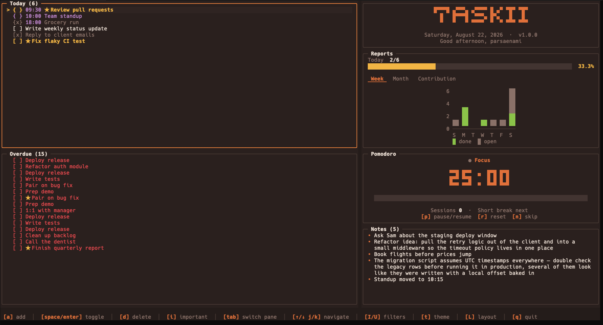
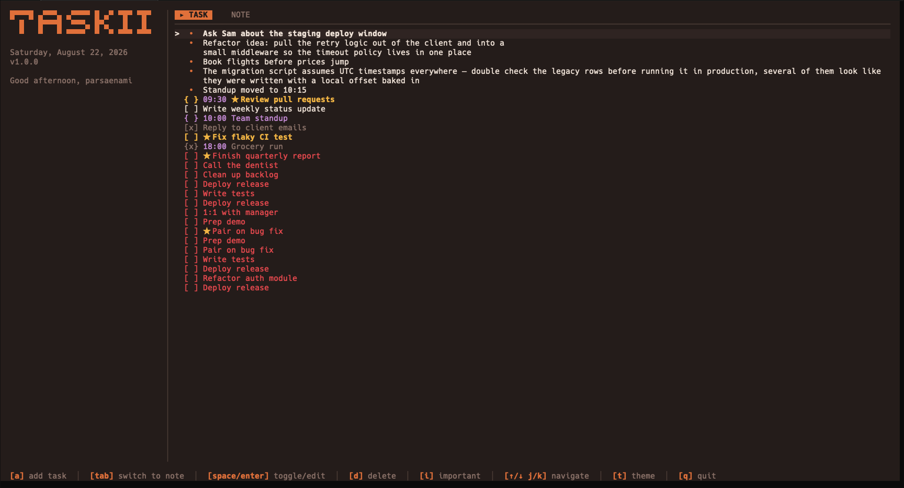

# taskii

A fast, keyboard-driven task manager and dashboard for your terminal — built with [Bubble Tea](https://github.com/charmbracelet/bubbletea).

Track today's tasks and appointments, see overdue items at a glance, run a Pomodoro timer, jot down notes, and review your progress with a GitHub-style contribution heatmap and weekly/monthly bar charts. Everything is saved locally as JSON — no account, no server, no telemetry.


<table>
<tr>
<td width="50%"><p align="center"><em>Normal mode — Today, Overdue, Reports, Pomodoro, and Notes panes</em></p></td>
<td width="50%"><p align="center"><em>Simple mode — one combined list of tasks, appointments, and notes</em></p></td>
</tr>
</table>

## Install

**Homebrew** (macOS/Linux):

```bash
brew install parsaenami/tap/taskii
```

**Install with curl** (macOS/Linux):

```bash
curl -fsSL https://raw.githubusercontent.com/parsaenami/taskii/main/install.sh | sh
```

**Download a binary** from the [releases page](https://github.com/parsaenami/taskii/releases) (macOS, Linux, Windows — amd64/arm64), then put it on your `PATH`.

**Or build from source** (requires [Go](https://go.dev) 1.26+):

```bash
go install github.com/parsaenami/taskii@latest
```

**Or clone and run:**

```bash
git clone https://github.com/parsaenami/taskii.git
cd taskii
go run .
```

## Run

```bash
taskii
```

Data is stored in `data/tasks.json`, `data/notes.json`, and `data/settings.json` in the current directory, created automatically on first run.

Flags:

```bash
taskii --mock     # launch with generated sample data instead of your real data
taskii --simple   # single-pane view: greeting + one combined list of tasks, overdue items, and notes
```

## Keybindings

| Key | Action |
| --- | --- |
| `↑/k`, `↓/j` | move selection |
| `tab` / `shift+tab` | switch focused pane |
| `a` | add task / note |
| `space` / `enter` | toggle done (tasks) or open note |
| `d` | delete (asks to confirm) |
| `i` | toggle important |
| `I` | filter: important only |
| `U` | filter: undone only |
| `e` | expand/collapse the notes board |
| `C` | clear all notes (asks to confirm) |
| `p` | start/pause Pomodoro |
| `r` | reset Pomodoro phase |
| `n` | skip Pomodoro phase |
| `t` / `T` | next / previous curated color theme |
| `alt+t` | open interactive theme browser (340+ themes, fuzzy search & live preview) |
| `L` | cycle layout |
| `q` / `ctrl+c` | quit |

On the Reports pane, `←/→` (or `h/l`) switch between the Week, Month, and Contribution charts instead of moving a selection.

## Features

- **Today / Overdue** — add tasks or timed appointments (type a trailing `14:30` to mark one as an appointment), toggle done, mark important, delete.
- **Notes** — a simple multi-line notes board, expandable to full screen.
- **Pomodoro timer** — start, pause, reset, and skip work/break phases.
- **Reports** — completion progress, a 7-day/monthly bar chart, and a contribution heatmap.
- **Themes** — 7 curated core themes cycled with `t`/`T`, 340+ terminal themes accessible via interactive fuzzy-search browser (`alt+t`), and extensible custom JSON/JSONL theme support.
- **Layouts** — multiple pane arrangements, cycled with `L`.

## Custom Themes

You can add your own custom palettes by placing `.json` or `.jsonl` files in any of the following directories:
- **Project local**: `data/themes/`
- **Linux**: `$XDG_CONFIG_HOME/taskii/themes/` or `~/.config/taskii/themes/`
- **macOS**: `~/Library/Application Support/taskii/themes/` or `~/.config/taskii/themes/`
- **Windows**: `%AppData%\taskii\themes\`

### Example: Taskii Theme Format (`theme.json`)
```json
{
  "name": "Custom Palette",
  "bg": "#121815",
  "pane_bg": "#18201c",
  "panel": "#202a25",
  "border": "#31423a",
  "border_focus": "#52b788",
  "text": "#d8f3dc",
  "muted": "#74c69d",
  "accent": "#52b788",
  "green": "#74c69d",
  "warning": "#ffe6a7",
  "danger": "#e63946",
  "purple": "#b5838d"
}
```

### Example: Terminal / Bubbletint Tint Format (`tint.json`)
```json
{
  "display_name": "My Terminal Tint",
  "id": "my_tint",
  "dark": true,
  "bg": "#1a1b26",
  "fg": "#c0caf5",
  "red": "#f7768e",
  "green": "#9ece6a",
  "yellow": "#e0af68",
  "blue": "#7aa2f7"
}
```

*(You can also bundle multiple themes into a single JSON array or a `.jsonl` file with one JSON theme object per line).*

## Development

```bash
go build ./...   # build
go vet ./...     # static checks
gofmt -l .       # formatting check
```

## Support

If taskii is useful to you, consider supporting its development:

- Inside Iran: [donito.me/parsaenami](https://donito.me/parsaenami)
- Outside Iran: [buymeacoffee.com/parsaenami](https://buymeacoffee.com/parsaenami)

## License

[MIT](LICENSE)
